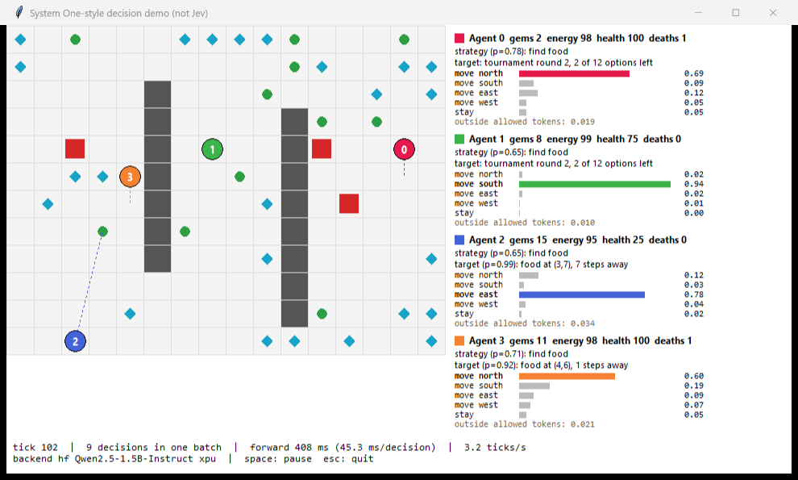

# 2D grid demo (live window)

Four agents collect gems, eat food and avoid roaming hazards in a live window. Every tick, **all
agents' due decisions go through the engine in one batched forward pass**. This demo runs live;
it records no traces, so it has no Master Viewer page. Code: `demo/grid/`.

```bash
.venv/Scripts/python -m demo.grid
```

```bash
.venv/Scripts/python -m demo.grid --config config/mock.toml
```

```bash
.venv/Scripts/python -m demo.grid --headless --ticks 100
```

Each agent has three tiers:

| tier | every | options |
|---|---|---|
| strategy | 12 ticks | collect gems / find food / avoid hazards / explore |
| target | 6 ticks, or when the target is reached or gone | every gem (24) or food item (12) on the map, safe spots, or regions. Sets larger than 8 use a **tournament**, one round per tick |
| action | every tick | move north / south / east / west / stay, each labelled with its outcome, e.g. `move west (target: 2 steps)`, `move north (wall)` |

**The agent is aware of its condition.**

- The strategy state spells out consequences ("about 20 ticks until starving").
- A change in condition (an energy band, low health, an adjacent hazard) makes the strategy
  re-decide on the next tick.
- Lower tiers see the target without its stale distance.

In a 4-seed × 250-tick comparison with the 3B, this took starvation from 2 of 4 runs to 0 of 4,
halved "stuck" time and raised gems by 22%. [`research.md`](research.md) → Observed → Agent
awareness has the diagnosis.

**The window shows:**

- each agent's strategy and target with their probabilities, and the tournament progress;
- the action probabilities as bars, and the outside-token mass;
- per tick, the batch size and forward-pass latency.

Agents glide between cells over about one tick; this is rendering only. Space pauses, Esc quits.
`--config config/mock.toml` runs without a model (random decisions). `--no-goals` gives flat
control (action tier only) for comparison.

**`--plan-budget N`** (default 1) lets each agent make at most N planning decisions (strategy,
target, tournament groups) per tick, next to its move. The rest wait for later ticks. This keeps
tick latency nearly constant. `-1` runs a whole tournament round per tick, which is how the
comparison below was measured.

**The most responsive setup measured** (hardware: README → Benchmarks) is one agent with the 3B
model:

```bash
.venv/Scripts/python -m demo.grid --config config/lenovo-3b.toml --agents 1
```

- That runs at ~5 ticks/s: ~137 ms for a move-only tick and ~230 ms when a planning decision rides
  along.
- Over 2 × 80 ticks the median was 194–195 ms, p90 236–238 ms and max 265–266 ms.
- Without the budget, planning ticks took 550–880 ms.

**Prefix caching.** `prefix_cache = true` (on by default in the bundled configs) reuses the
keys/values of prompt prefixes that repeat across ticks. That saves ~9–10% here.

- A 3B pass costs ~80 ms even for 8 tokens on the reference GPU, so reuse cannot go much further.
- Prompt orders that reuse more (`prompt_order = "question_first"` or `"options_first"`) were up to
  21% faster, but hurt accuracy, and the agent played badly.

Details: [`research.md`](research.md) → Observed → Prefix caching.

## Results



With the real model on the Lenovo, the demo runs at ~3 ticks/s: 300–450 ms per tick for 6–9
decisions in one batch. Tiered goals vs flat control, 100 ticks, 4 agents, mean of 3 seeds
(`bench/results/demo_compare/demo_compare_20260926_051317.json`):

| setup | gems | food eaten | hazard hits | forward ms/tick (median) |
|---|---:|---:|---:|---:|
| model, tiered goals | 36.0 | 59.3 | 10.7 | 312 |
| model, flat (action tier only) | 15.7 | 11.0 | 5.7 | 198 |
| random decisions (mock), tiered goals | 17.7 | 10.7 | 8.3 | 3 |

Flat control was no better than random. Tiered goals gave 2.3× the gems and 5.4× the food, but
also more hazard hits. Reproduce:

```bash
.venv/Scripts/python -m bench.demo_compare
```
